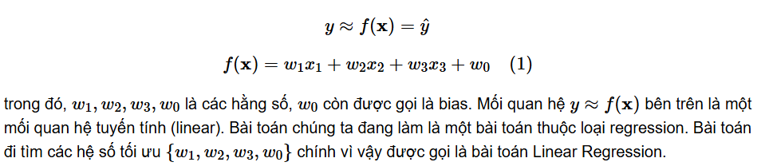
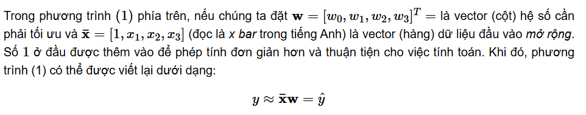
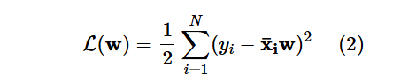
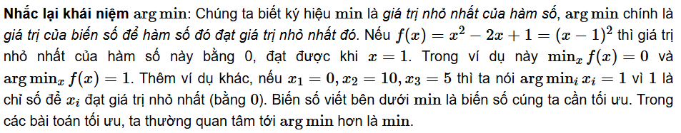
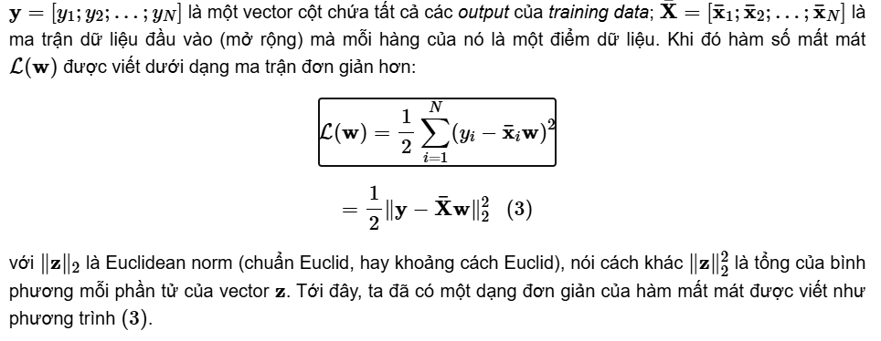
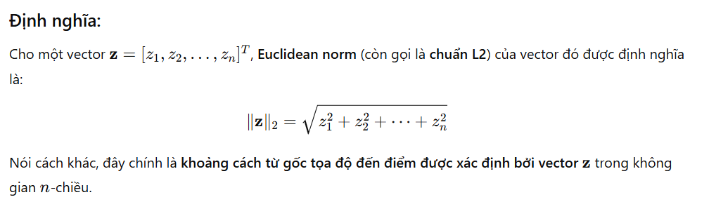
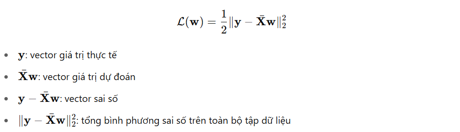
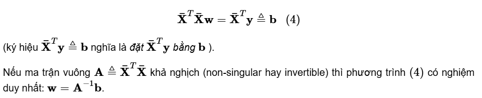

`Linear Regression (Hồi Quy Tuyến Tính)` là một trong những thuật toán cơ bản nhất (và đơn giản nhất) của Machine Learning. Đây là một thuật toán `Supervised learning`.

# 1. Giới thiệu
**Bài toán:** Một căn nhà rộng x1 (m2), x2 phòng ngủ và cách trung tâm thành phố x3 (km) thì có giá là bao nhiêu. Giả sử chúng ta đã có số liệu thống kê từ 1000 căn nhà trong thành phố đó, liệu rằng khi có một căn nhà mới với các thông số về diện tích, số phòng ngủ và khoảng cách tới trung tâm, chúng ta có thể dự đoán được giá của căn nhà đó không?

Một cách đơn giản nhất, chúng ta có thể thấy rằng: 

- i) diện tích nhà càng lớn thì giá nhà càng cao; 

- ii) số lượng phòng ngủ càng lớn thì giá nhà càng cao; 

- iii) càng xa trung tâm thì giá nhà càng giảm. 

Một hàm số đơn giản nhất có thể mô tả mối quan hệ giữa giá nhà và 3 đại lượng đầu vào là:

**Phân biệt y và ŷ:**
- y: Giá trị thực tế (ground truth, actual value)
   - Đây là giá trị đúng hoặc giá trị quan sát được trong thực tế.
   - y đến từ dữ liệu thực tế (thu thập, đo lường, khảo sát...).
- ŷ : Giá trị dự đoán (predicted value)
   - Đây là giá trị mà mô hình dự đoán được, sau khi học từ dữ liệu, được tính từ hàm dự đoán.
   - Không nhất thiết giống y; càng gần y thì mô hình càng tốt.
# 2. Phân tích toán học
## 2.1 Dạng của Linear Regression

## 2.2 Sai số dự đoán
Chúng ta mong muốn rằng sự sai khác e giữa giá trị thực y và giá trị dự đoán ŷ (đọc là y hat trong tiếng Anh) là nhỏ nhất. Nói cách khác, chúng ta muốn giá trị sau đây càng nhỏ càng tốt:

## 2.3 Hàm mất mát
Điều tương tự xảy ra với tất cả các cặp (input, outcome) (xi, yi), i=1,2,....,N với N là số lượng dữ liệu quan sát được. Điều chúng ta muốn, tổng sai số là nhỏ nhất, tương đương với việc tìm w để hàm số sau đạt giá trị nhỏ nhất:

Hàm số L(w) gọi là hàm mất mát (loss function) của bài toán Linear Regression. Chúng ta luôn mong muốn rằng sự mất mát (sai số) là nhỏ nhất, điều đó đồng nghĩa với việc tìm vector hệ số w sao cho giá trị của hàm mất mát này càng nhỏ càng tốt.

Giá trị của w làm cho hàm mất mát đạt giá trị nhỏ nhất được gọi là điểm tối ưu (optimal point), ký hiệu:

Trước khi đi tìm lời giải, chúng ta đơn giản hóa phép toán trong phương trình hàm mất mát (2). 

Định nghĩa Euclidean norm:

## 2.4 Nghiệm cho bài toán Linear Regression
Cách phổ biến nhất để tìm nghiệm cho một bài toán tối ưu là giải phương trình đạo hàm (gradient) bằng 0.

Đạo hàm theo w của hàm mất mát là:

Phương trình đạo hàm bằng 0 tương đương với:

Vậy nếu ma trận A không khả nghịch (có định thức bằng 0) thì trong trường hợp này thì hoặc phương trinh (4) vô nghiệm, hoặc là nó có vô số nghiệm.Khi đó, chúng ta sử dụng khái niệm giả nghịch đảo (Giả nghịch đảo (pseudo inverse) là trường hợp tổng quát của nghịch đảo khi ma trận không khả nghịch hoặc thậm chí không vuông).

Với khái niệm giả nghịch đảo, điểm tối ưu của bài toán Linear Regression có dạng:

