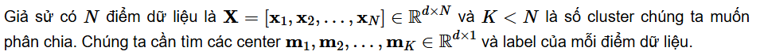
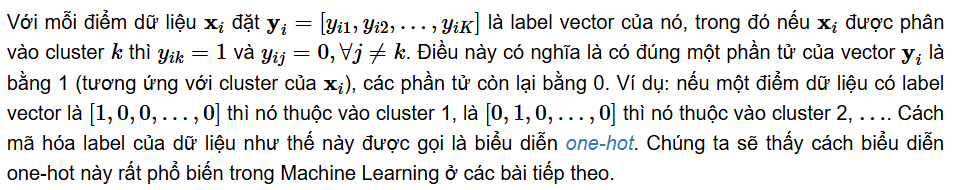
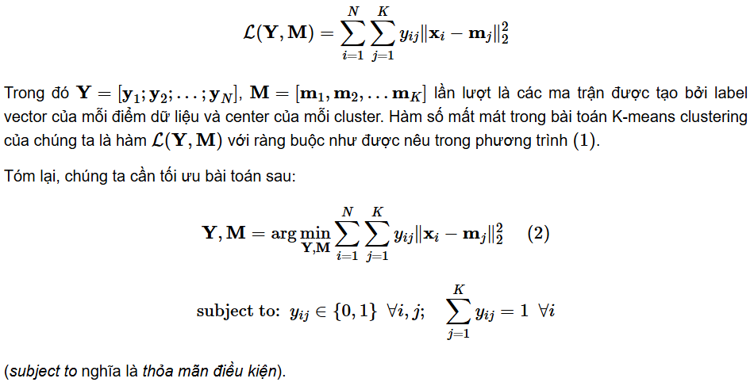
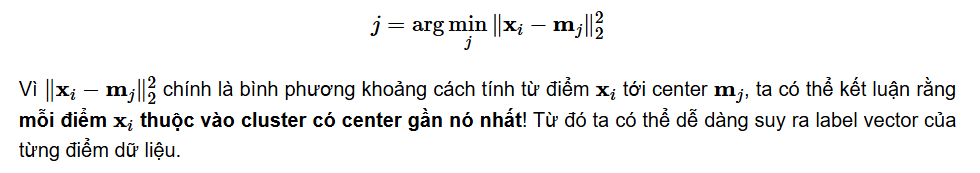
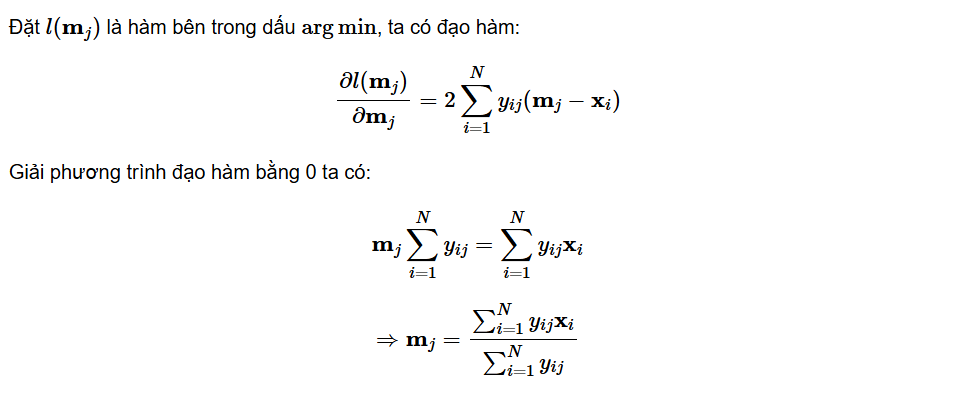
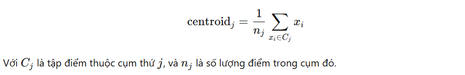

`K-means clustering (phân cụm K-means)` là một trong những thuật toán cơ bản nhất trong `Unsupervised learning`.

# 1. Giới thiệu
Trong thuật toán `K-means clustering`, chúng ta không biết `nhãn (label)` của từng điểm dữ liệu. Mục đích là làm thể nào để phân dữ liệu thành **các `cụm (cluster)` khác nhau** sao cho dữ liệu trong cùng một cụm có **tính chất giống nhau**.

Ý tưởng đơn giản nhất về cluster (cụm) là tập hợp các điểm ở gần nhau trong một không gian nào đó (không gian này có thể có rất nhiều chiều trong trường hợp thông tin về một điểm dữ liệu là rất lớn).

Hình bên dưới là ví dụ về 3 cụm dữ liệu (cluster).

Giả sử mỗi cluster có một điểm đại diện (center) màu vàng. Và những điểm xung quanh mỗi center thuộc vào cùng nhóm với center đó. Khi xét một điểm bất kỳ, ta xét xem điểm đó gần với center nào nhất thì nó thuộc về cùng nhóm với center đó.

# 2. Phân tích toán học
Mục đích cuối cùng của thuật toán phân nhóm này là: từ dữ liệu đầu vào và số lượng nhóm chúng ta muốn tìm, hãy chỉ ra center của mỗi nhóm và phân các điểm dữ liệu vào các nhóm tương ứng. Giả sử thêm rằng mỗi điểm dữ liệu chỉ thuộc vào đúng một nhóm.
## 2.1 Một số ký hiệu toán học

Biểu diễn `one-hot`:

## 2.2 Hàm mất mát và bài toán tối ưu
Nếu ta coi center m(k) là center (hoặc representative) của mỗi cluster và ước lượng tất cả các điểm được phân vào cluster này bởi m(k), thì một điểm dữ liệu x(i) được phân vào cluster k sẽ bị sai số là x(i)−m(k). Chúng ta mong muốn sai số này có trị tuyệt đối nhỏ nhất nên ta sẽ tìm cách để đại lượng sau đây đạt giá trị nhỏ nhất:

Hơn nữa, vì xi được phân vào cluster k nên y(ik)=1,y(ij)=0, ∀j≠k. Khi đó, biểu thức bên trên sẽ được viết lại là:

Sai số cho toàn bộ dữ liệu sẽ là:

## 2.3 Thuật toán tối ưu hàm mất mát
### 2.3.1 Cố định M, tìm Y
Giả sử đã tìm được các centers, hãy tìm các label vector để hàm mất mát đạt giá trị nhỏ nhất. Điều này tương đương với việc tìm cluster cho mỗi điểm dữ liệu.

Khi các centers là cố định, bài toán tìm label vector cho toàn bộ dữ liệu có thể được chia nhỏ thành bài toán tìm label vector cho từng điểm dữ liệu 
x(i) như sau:

Vì chỉ có một phần tử của label vector y(i) bằng 1 nên bài toán có thể tiếp tục được viết dưới dạng đơn giản hơn:

### 2.3.2 Cố định Y, tìm M
Giả sử đã tìm được cluster cho từng điểm, hãy tìm center mới cho mỗi cluster để hàm mất mát đạt giá trị nhỏ nhất.

Một khi chúng ta đã xác định được label vector cho từng điểm dữ liệu, bài toán tìm center cho mỗi cluster được rút gọn thành:

Hay nói một cách đơn giản: **m(j) là trung bình cộng của các điểm trong cluster j**.
## 2.4 Tóm tắt thuật toán
**Đầu vào:** Dữ liệu X và số lượng cluster cần tìm K.

**Đầu ra:** Các center M và label vector cho từng điểm dữ liệu Y.

1. *Chọn K điểm bất kỳ làm các center ban đầu.*
- Chọn ngẫu nhiên 𝐾 điểm từ tập dữ liệu hoặc chọn ngẫu nhiên trong không gian dữ liệu để làm trung tâm cụm ban đầu.
- Các điểm này tạm thời coi là đại diện cho các cụm.

2. *Phân mỗi điểm dữ liệu vào cluster có center gần nó nhất.*
- Với mỗi điểm dữ liệu 𝑥𝑖, tính khoảng cách từ nó đến tất cả các centroid.
- Gán điểm đó vào cụm có centroid gần nhất.
 
3. *Nếu việc gán dữ liệu vào từng cluster ở bước 2 không thay đổi so với vòng lặp trước nó thì ta dừng thuật toán.*
- Nếu không có sự thay đổi (hoặc rất nhỏ) → DỪNG.
- Nếu có thay đổi → tiếp tục.

4. *Cập nhật center cho từng cluster bằng cách lấy trung bình cộng của tất các các điểm dữ liệu đã được gán vào cluster đó sau bước 2.*
- Với mỗi cụm, tính trung bình cộng tất cả các điểm trong cụm.
- Điểm trung bình mới này sẽ trở thành centroid mới cho cụm.

   

5. *Quay lại bước 2.*
- Tiếp tục lặp lại việc gán cụm → cập nhật centroid cho đến khi Centroid không đổi đáng kể, hoặc đạt số vòng lặp tối đa.

