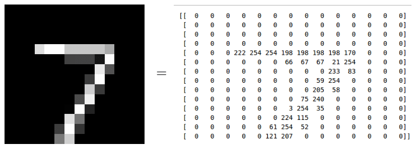
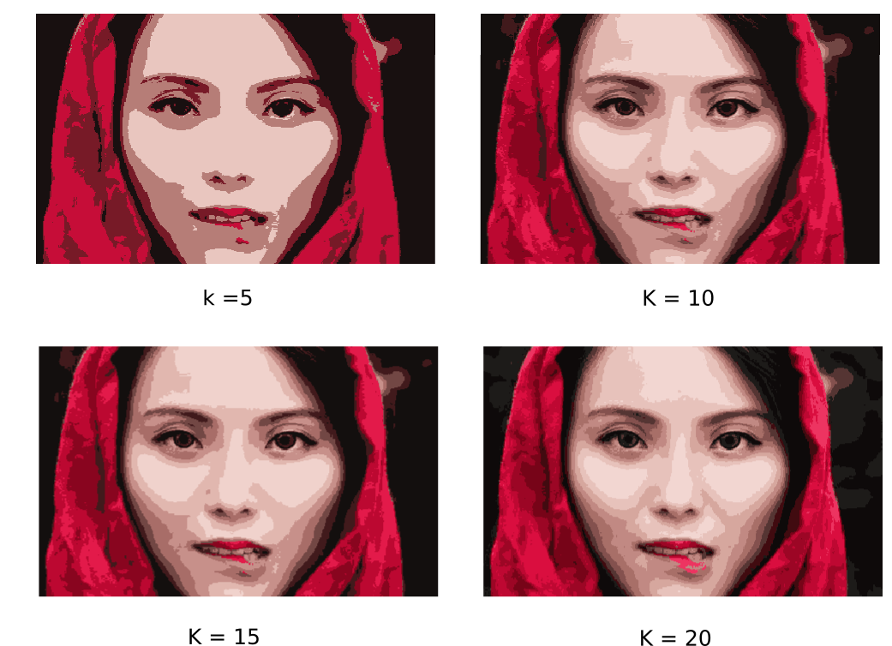

Áp dụng thuật toán K-means clustering vào ba bài toán xử lý ảnh thực tế hơn: 

i) Phân nhóm các chữ số viết tay. 

ii) Tách vật thể (image segmentation) 

iii) Nén ảnh/dữ liệu (image compression).

# 1. Phân nhóm chữ số viết tay
## 1.1 Bộ cơ sở dữ liệu MNIST
Bộ cơ sở dữ liệu MNIST là bộ cơ sở dữ liệu lớn nhất về chữ số viết tay và được sử dụng trong hầu hết các thuật toán nhận dạng hình ảnh (Image Classification).

MNIST bao gồm hai tập con: tập dữ liệu huấn luyện (training set) có tổng cộng 60k ví dụ khác nhau về chữ số viết tay từ 0 đên 9, tập dữ liệu kiểm tra (test set) có 10k ví dụ khác nhau. Tất cả đều đã được gán nhãn.

Mỗi bức ảnh là một ảnh đen trắng (có 1 channel), có kích thước 28x28 pixel (tổng cộng 784 pixels). Mỗi pixel mang một giá trị là một số tự nhiên từ 0 đến 255. Các pixel màu đen có giá trị bằng 0, các pixel càng trắng thì có giá trị càng cao (nhưng không quá 255). Dưới đây là một ví dụ về chữ số 7 và giá trị các pixel của nó:

## 1.2 Bài toán phân nhóm giả định
Bài toán: Giả sử rằng chúng ta không biết nhãn của các chữ số này, chúng ta muốn phân nhóm các bức ảnh gần giống nhau về một nhóm.

Trước khi áp dụng thuật toán K-means clustering, chúng ta cần coi mỗi bức ảnh là một điểm dữ liệu.Cách làm này chỉ là cách đơn giản nhất để mô tả dữ liệu ảnh bằng 1 vector. 
## 1.3 Kết quả
Áp dụng K-means clustering vào tập test set của bộ cơ sở dữ liệu MNIST với K = 10 cluster. Cột 1: centers của các cluster. Các cột còn lại: Mỗi hàng là 20 điểm dữ liệu ngẫu nhiên được chọn ra từ mỗi cluster:

Tuy nhiên, các bức ảnh lấy ra ngẫu nhiên từ mỗi nhóm trông không thực sự giống nhau. Lý do có thể là những bức ảnh này ở xa các center của mỗi nhóm (mặc dù center đó đã là gần nhất). Như vậy thuật toán K-means clustering làm việc không thực sự tốt trong trường hợp này.

Áp dụng K-means clustering vào tập test set của bộ cơ sở dữ liệu MNIST với K = 10 cluster. Cột 1: centers của các cluster. Các cột còn lại: Mỗi hàng là 20 điểm dữ liệu gần center nhất của mỗi cluster:

**Nhận xét:**

- Có hai kiểu viết chữ số 1, một thẳng, một chéo. Và K-means clustering nghĩ rằng đó là hai chữ số khác nhau.
- Hàng số 9, chữ số 4 và 9 được phân vào cùng 1 cluster. Sự thật là hai chữ số này cũng khá giống nhau. Điều tương tự xảy ra đối với hàng số 7 với các chữ số 7, 8, 9 được xếp vào 1 cluster.

# 2. Object Segmentation (tách vật thể trong ảnh)
**Đặt vấn đề:** Giả sử chúng ta có bức ảnh dưới đây và muốn một thuật toán tự động nhận ra vùng khuôn mặt và tách nó ra.

Bức ảnh có ba màu chủ đạo: *hồng ở khăn và môi*; *đen ở mắt, tóc, và hậu cảnh*; *màu da ở vùng còn lại của khuôn mặt*. Vậy chúng ta có thể áp dụng thuật toán K-means clustering để phân các pixel ảnh thành 3 clusters, sau đó chọn cluster chứa phần khuôn mặt (phần này do con người làm).

Đây là một bức ảnh màu, mỗi điểm ảnh sẽ được biểu diễn bới 3 giá trị tương ứng với màu Red, Green, và Blue (mỗi giá trị này cũng là một số tự nhiên không vượt quá 255). Nếu ta coi mỗi điểm dữ liệu là một vector 3 chiều chứa các giá trị này, sau đó áp dụng thuật toán K-means clustering.

Ba màu: Hồng, đen, và màu da đã được phân nhóm. Và khuôn mặt có thể được tách ra từ phần có màu da (và vùng bên trong nó). 
# 3. Image Compression (nén ảnh và nén dữ liệu nói chung)
Trong bài toán Segmentation phía trên, chúng ta có 3 clusters, và mỗi một điểm ảnh sau khi xử lý sẽ được biểu diễn bởi 1 số tương ứng với 1 cluster.

Tuy nhiên, chất lượng bức ảnh rõ ràng đã giảm đi nhiều. Tôi làm một thí nghiệm nhỏ với số lượng clusters được tăng lên là 5, 10, 15, 20.

Kết quả:

