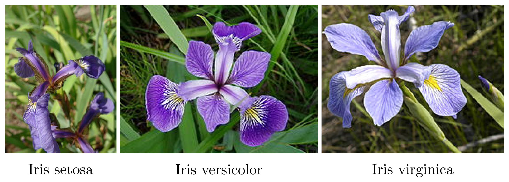

`K-nearest neighbor` (hay KNN) là một phương pháp trong Machine Learning, một thuật toán được xếp vào loại lazy (machine) learning (máy lười học).
# 1. K-nearest neighbor
`K-nearest neighbor` là một trong những thuật toán supervised-learning đơn giản nhất (mà hiệu quả trong một vài trường hợp) trong Machine Learning.

Khi training, thuật toán này *không học một điều gì từ dữ liệu training* (đây cũng là lý do thuật toán này được xếp vào loại lazy learning), *mọi tính toán được thực hiện khi nó cần dự đoán kết quả của dữ liệu mới*.

`K-nearest neighbor` có thể áp dụng được vào cả hai loại của bài toán Supervised learning là Classification và Regression. KNN còn được gọi là một thuật toán Instance-based hay Memory-based learning.

Có một vài khái niệm tương ứng người-máy như sau:
| Ngôn ngữ người         | Ngôn ngữ Máy Học         | in Machine Learning     |
|------------------------|--------------------------|--------------------------|
| Câu hỏi                | Điểm dữ liệu             | Data point               |
| Đáp án                 | Đầu ra, nhãn             | Output, Label            |
| Ôn thi                 | Huấn luyện               | Training                 |
| Tập tài liệu mang vào phòng thi | Tập dữ liệu tập huấn | Training set            |
| Đề thi                 | Tập dữ liệu kiểm thử     | Test set                 |
| Câu hỏi trong đề thi   | Dữ liệu kiểm thử         | Test data point          |
| Câu hỏi có đáp án sai  | Nhiễu                    | Noise, Outlier           |
| Câu hỏi gần giống      | Điểm dữ liệu gần nhất    | Nearest Neighbor         |

`KNN` là thuật toán đi tìm đầu ra của một điểm dữ liệu mới bằng cách chỉ dựa trên thông tin của K điểm dữ liệu trong training set gần nó nhất (K-lân cận), không quan tâm đến việc có một vài điểm dữ liệu trong những điểm gần nhất này là nhiễu.

Hình dưới đây là một ví dụ về KNN trong classification với K = 1:

Ví dụ trên đây là bài toán Classification với 3 classes: Đỏ, Lam, Lục. Mỗi điểm dữ liệu mới (test data point) sẽ được gán label theo màu của điểm mà nó thuộc về. Trong hình này, có một vài vùng nhỏ xem lẫn vào các vùng lớn hơn khác màu.

Ví dụ có một điểm màu Lục ở gần góc 11 giờ nằm giữa hai vùng lớn với nhiều dữ liệu màu Đỏ và Lam. Điểm này rất có thể là nhiễu. Dẫn đến nếu dữ liệu test rơi vào vùng này sẽ có nhiều khả năng cho kết quả không chính xác.

# 2. Lưu ý
Có một điều đáng lưu ý là `KNN` phải nhớ tất cả các điểm dữ liệu training, việc này không được lợi về cả bộ nhớ và thời gian tính toán - giống như khi cậu bạn của chúng ta không tìm được câu trả lời cho câu hỏi cuối cùng.

# 3. Ví dụ trên python
`Iris flower dataset` là một bộ dữ liệu nhỏ, bao gồm thông tin của ba loại hoa Iris (một loài hoa lan) khác nhau: `Iris setosa`, `Iris virginica` và `Iris versicolor`. Mỗi loại có 50 bông hoa được đo với dữ liệu là 4 thông tin: `chiều dài`, `chiều rộng đài hoa (sepal)`, và `chiều dài`, `chiều rộng cánh hoa (petal)`.

Trong phần này, chúng ta sẽ tách 150 dữ liệu trong `Iris flower dataset` ra thành 2 phần, gọi là `training set` và `test set`. 

Thuật toán KNN sẽ dựa vào trông tin ở training set để dự đoán xem mỗi dữ liệu trong test set tương ứng với loại hoa nào. 

Dữ liệu được dự đoán này sẽ được đối chiếu với loại hoa thật của mỗi dữ liệu trong test set để đánh giá hiệu quả của KNN.