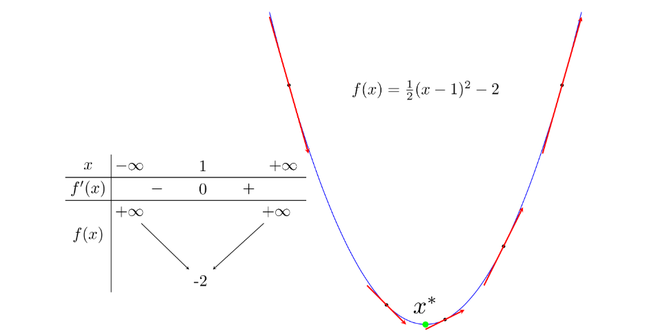
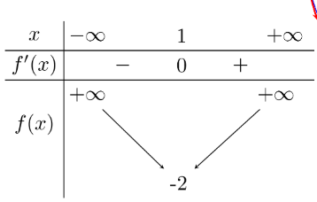
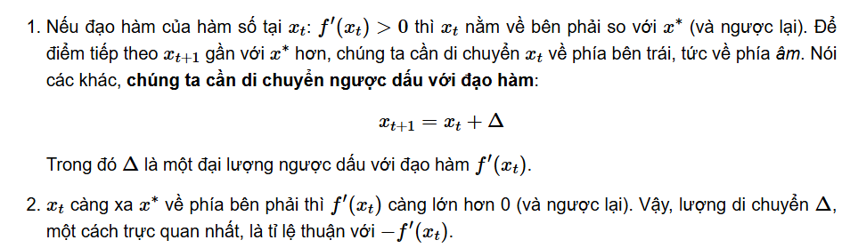

# 1. Giới thiệu

Điểm màu xanh lục là điểm local minimum (cực tiểu), và cũng là điểm làm cho hàm số đạt giá trị nhỏ nhất (global minimum). 

- Điểm local minimum x∗ của hàm số là điểm có đạo hàm f′(x∗) bằng 0. Hơn thế nữa, trong lân cận của nó, đạo hàm của các điểm phía bên trái x∗ là không dương, đạo hàm của các điểm phía bên phải x∗ là không âm.
- Đường tiếp tuyến với đồ thị hàm số đó tại 1 điểm bất kỳ có hệ số góc chính bằng đạo hàm của hàm số tại điểm đó.

Trong hình phía trên, các điểm bên trái của điểm local minimum màu xanh lục có đạo hàm âm, các điểm bên phải có đạo hàm dương. Và đối với hàm số này, càng xa về phía trái của điểm local minimum thì đạo hàm càng âm, càng xa về phía phải thì đạo hàm càng dương.

# 2. Gradient Descent
Các điểm local minimum là nghiệm của phương trình đạo hàm bằng 0. Nếu bằng một cách nào đó có thể tìm được toàn bộ (hữu hạn) các điểm cực tiểu, ta chỉ cần thay từng điểm local minimum đó vào hàm số rồi tìm điểm làm cho hàm có giá trị nhỏ nhất. Tuy nhiên, trong hầu hết các trường hợp, việc giải phương trình đạo hàm bằng 0 là bất khả thi. Nguyên nhân có thể đến từ sự phức tạp của dạng của đạo hàm, từ việc các điểm dữ liệu có số chiều lớn, hoặc từ việc có quá nhiều điểm dữ liệu.

Hướng tiếp cận phổ biến nhất là **xuất phát từ một điểm mà chúng ta coi là gần với nghiệm của bài toán, sau đó dùng một phép toán lặp để tiến dần đến điểm cần tìm, tức đến khi đạo hàm gần với 0**. Gradient Descent (viết gọn là GD) và các biến thể của nó là một trong những phương pháp được dùng nhiều nhất.

# 3. Gradient Descent cho hàm 1 biến
Giả sử x(t) là điểm ta tìm được sau vòng lặp thứ t. Ta cần tìm một thuật toán để đưa x(t) về càng gần x∗ càng tốt.

**Nhận xét:**

Hai nhận xét phía trên cho chúng ta một cách cập nhật đơn giản là:

Trong đó `η (đọc là eta)` là một số dương được gọi là `learning rate (tốc độ học)`. Dấu trừ thể hiện việc chúng ta phải đi ngược với đạo hàm.
# 4. Gradient Descent cho hàm nhiều biến
Tương tự như hàm 1 biến, thuật toán GD cho hàm nhiều biến cũng bắt đầu bằng một điểm dự đoán θ(0), sau đó, ở vòng lặp thứ t, quy tắc cập nhật là:

Quy tắc cần nhớ: **luôn luôn đi ngược hướng với đạo hàm.**