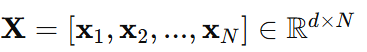

Cứ làm đi, sai đâu sửa đấy, cuối cùng sẽ thành công!

Đó chính là ý tưởng chính của một thuật toán rất quan trọng trong Machine Learning - thuật toán `Perceptron Learning Algorithm` hay `PLA`.

Bài toán Perceptron được phát biểu như sau: Cho hai class được gán nhãn, hãy tìm một đường phẳng sao cho toàn bộ các điểm thuộc class 1 nằm về 1 phía, toàn bộ các điểm thuộc class 2 nằm về phía còn lại của đường phẳng đó. Với giả định rằng tồn tại một đường phẳng như thế.

Nếu tồn tại một đường phẳng phân chia hai class thì ta gọi hai class đó là `linearly separable`. Các thuật toán classification tạo ra các boundary là các đường phẳng được gọi chung là `Linear Classifier`.

# 1. Giới thiệu
`Perceptron` là một thuật toán Classification cho trường hợp đơn giản nhất: chỉ có hai class (lớp) (bài toán với chỉ hai class được gọi là binary classification) và cũng chỉ hoạt động được trong một trường hợp rất cụ thể.

Giả sử chúng ta có hai tập hợp dữ liệu đã được gán nhãn được minh hoạ trong Hình dưới đây:

Hai class của chúng ta là tập các điểm màu xanh và tập các điểm màu đỏ. 

Bài toán đặt ra là: từ dữ liệu của hai tập được gán nhãn cho trước, hãy xây dựng một classifier (bộ phân lớp) để khi có một điểm dữ liệu hình tam giác màu xám mới, ta có thể dự đoán được màu (nhãn) của nó.

# 2. Thuật toán Perceptron
## 2.1 Một số ký hiệu
- **Dữ liệu đầu vào:**

- **Nhãn (label) tương ứng:**

- **Hàm phân biệt tuyến tính (decision boundary):**

với trường hợp mỗi điểm dữ liệu có số chiều d = 2. Giả sử đường thẳng w1x1 + w2x2 + w0 = 0 chính là nghiệm cần tìm như Hình 2 dưới đây:

Nhận xét rằng các điểm nằm về cùng 1 phía so với đường thẳng này sẽ làm cho hàm số fw(x) mang cùng dấu. Chỉ cần đổi dấu của w nếu cần thiết, ta có thể giả sử các điểm nằm trong nửa mặt phẳng nền xanh mang dấu dương (+), các điểm nằm trong nửa mặt phẳng nền đỏ mang dấu âm (-). Các dấu này cũng tương đương với nhãn y của mỗi class.

Vậy nếu w là một nghiệm của bài toán Perceptron, với một điểm dữ liệu mới x chưa được gán nhãn, ta có thể xác định class của nó bằng phép toán đơn giản như sau:

## 2.2 Xây dựng hàm mất mát
Vẫn trong không gian hai chiều, giả sử đường thẳng w1x1 + w2x2 + w0 = 0 được cho như hình dưới đây:

Trong trường hợp này, các điểm được khoanh tròn là các điểm bị misclassified (phân lớp lỗi). Điều chúng ta mong muốn là không có điểm nào bị misclassified.

Hàm mất mát đơn giản nhất chúng ta nghĩ đến là hàm đếm số lượng các điểm bị misclassied và tìm cách tối thiểu hàm số này:

**Nhận xét:** Một điểm quan trọng, hàm số này là rời rạc, không tính được đạo hàm theo w nên rất khó tối ưu.

Xét hàm mất mát sau đây để việc tối ưu khả thi hơn.

**Nhận xét:** Hàm J() khác một chút với hàm J1() ở việc bỏ đi hàm sgn. Hàm mất mát này cũng được cho là tốt hơn hàm J1() vì nó trừng phạt rất nặng những điểm lấn sâu sang lãnh thổ của class kia.

Xét từng điểm một, nếu điểm đó bị misclassified thì tiến đường boundary về phía làm cho điểm đó được classifed đúng. Có thể thấy rằng, khi di chuyển đường boundary này, các điểm trước đó được classified đúng có thể lại bị misclassified. Mặc dù vậy, PLA vẫn được đảm bảo sẽ hội tụ sau một số hữu hạn bước. Tức là cuối cùng, ta sẽ tìm được đường phẳng phân chia hai lớp, miễn là hai lớp đó là linearly separable.

# 3. Tóm tắt PLA
1. Chọn ngẫu nhiên một vector hệ số w với các phần tử gần 0.
2. Duyệt ngẫu nhiên qua từng điểm dữ liệu xi:
- Nếu xi được phân lớp đúng, tức sgn(wTxi) = yi, chúng ta không cần làm gì.
- Nếu xi bị misclassifed, cập nhật w theo công thức:
            
                                 w=w+yixi

3. Kiểm tra xem có bao nhiêu điểm bị misclassifed. Nếu không còn điểm nào, dừng thuật toán. Nếu còn, quay lại bước 2.
