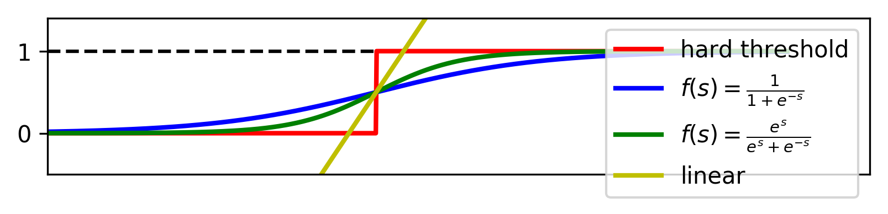
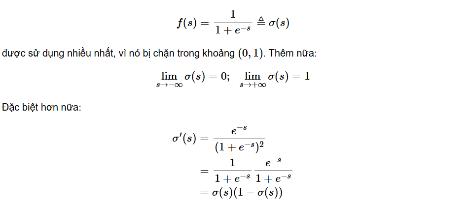
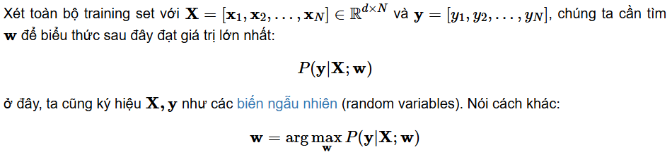
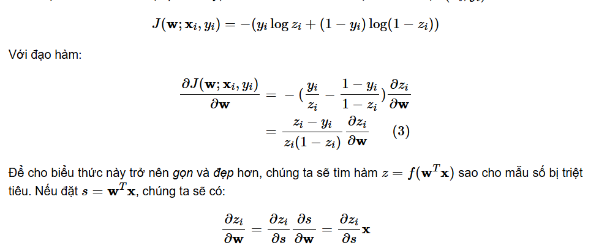
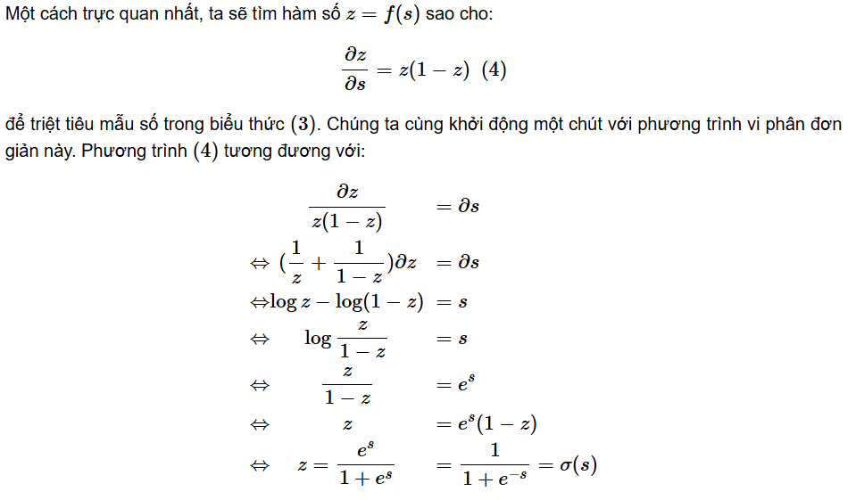

# 1. Giới thiệu
Hai mô hình tuyến tính (linear models) `Linear Regression` và `Perceptron Learning Algorithm (PLA)` đều có chung một dạng:

trong đó f() được gọi là activation function, và x được hiểu là dữ liệu mở rộng với x(0)=1 được thêm vào để thuận tiện cho việc tính toán. Với linear regression thì f(s)=s, với PLA thì f(s)=sgn(s).

Còn có mô hình thứ ba với một activation khác, được sử dụng cho các bài toán flexible hơn. Trong dạng này, đầu ra có thể được thể hiện dưới dạng xác suất (probability).

**Ví dụ:** xác suất thi đỗ nếu biết thời gian ôn thi, xác suất ngày mai có mưa dựa trên những thông tin đo được trong ngày hôm nay,…

Mô hình mới này của chúng ta có tên là logistic regression. Mô hình này giống với linear regression ở khía cạnh đầu ra là số thực, và giống với PLA ở việc đầu ra bị chặn (trong đoạn [0,1]).
# 2. Mô hình Logistic Regression
Đầu ra dự đoán của logistic regression thường được viết chung dưới dạng:

Trong đó θ được gọi là logistic function.

Một số activation cho mô hình tuyến tính:

- Đường màu vàng biểu diễn linear regression.
- Đường màu đỏ (chỉ khác với activation function của PLA ở chỗ hai class là 0 và 1 thay vì -1 và 1) cũng thuộc dạng ngưỡng cứng (hard threshold).
- Các đường màu xanh lam và xanh lục phù hợp với bài toán logistic regression.
 
# 3. Hàm mất mát và phương pháp tối ưu
**Sigmoid function:**

## 3.1 Xây dựng hàm mất mát
giả sử rằng xác suất để một điểm dữ liệu x rơi vào class 1 là f(wTx) và rơi vào class 0 là 1−f(wTx).

Mục đích là tìm các hệ số w sao cho f(wTxi) càng gần với 1 càng tốt với các điểm dữ liệu thuộc class 1 và càng gần với 0 càng tốt với những điểm thuộc class 0.

Ký hiệu zi=f(wTxi) và viết gộp lại hai biểu thức bên trên ta có:

Biểu thức này là tương đương với hai biểu thức (1) và (2) ở trên vì khi yi=1, phần thứ hai của vế phải sẽ triệt tiêu, khi yi=0, phần thứ nhất sẽ bị triệt tiêu!

## 3.2 Tối ưu hàm mất mát
Hàm mất mát với chỉ một điểm dữ liệu (xi,yi)là:

## 3.3 Công thức cập nhật cho logistic sigmoid regression

Và công thức cập nhật (theo thuật toán SGD) cho logistic regression là:

